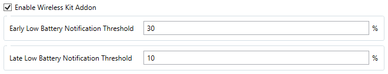

# Wireless Kit Addon

A plugin for users that have installed a wireless kit inside of their Wacom CTH Tablets.

This will allow you to monitor your tablet's battery as well as its charging status & get notified when the battery is low.
A tray icon will be added for each tablet that has a wireless kit installed.

You can choose your own battery percentage threshold for the notification.

## Dependencies

### For All Platforms

- OpenTabletDriver (And its dependencies),
- .NET 8.0 Desktop Runtime (for the Tray icon & notifications), [Link](https://dotnet.microsoft.com/en-us/download/dotnet/8.0#:~:text=.NET%20Desktop%20Runtime)

### For Linux Only

- libnotify-bin,
- notification-daemon,
- dbus.

## Compatibility

- OpenTabletDriver 0.5.3.3 (for `WirelessKitAddon-0.5.x.zip`)
- OpenTabletDriver 0.6.4.0 (for `WirelessKitAddon-0.6.x.zip`)

## How to install

### From the Plugin Manager (When merged)

1. Open the Plugin Manager,
2. Look for "Wireless Kit Addon",
3. Click Install.

### Manual Installation

1. Head to the [Releases Page](https://github.com/Mrcubix/WirelessKitAddon/releases/latest),
2. Download `WirelessKitAddon-0.6.x.zip` if you use OpenTabletDriver 0.6.4.0 or `WirelessKitAddon-0.5.x.zip` if you use OpenTabletDriver 0.5.3.3,
3. Open the Plugin Manager in OpenTabletDriver,
4. Click on `Install plugin...` and select the downloaded zip file.

## How to setup

1. Head to the `Filters` tab,
2. Look for `Wireless Kit Addon`,
3. Tick `Enable`,
4. Tweak the threshold if needed,
5. Head to the `Tools` tab,
6. Click on `Wireless Kit Daemon`,
7. Tick `Enable`,
8. Save & Apply and you should be set.

If all goes well, you should see something simillar to this in the console:

As well as the previously mentioned tray icon.

## Known Issues

- Battery has only 31 different states, so the battery percentage might not be 100% accurate.
- Wireless Kit will report 100% battery when the tablet is plugged in, this is a limitation of the wireless kit itself.
